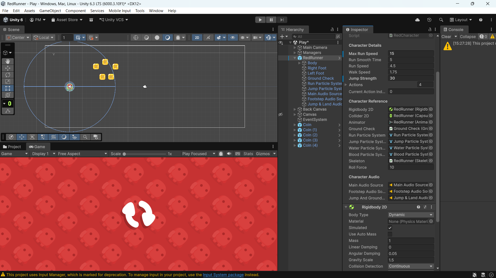

# Lab 01 - Khám phá dự án RedRunner
## Thông tin sinh viên
- **Họ tên**: Phan Lê Xuân Mạnh
- **MSSV**: 2312686
- **Lớp**: CTK47PM
## Mô tả
Bài thực hành Lab 01 môn **Game 2D Development with Unity**.
Khám phá và phân tích dự án game RedRunner - một Platformer 2D mã nguồn mở
được phát triển bởi Bayat Games.
## Các thay đổi đã thực hiện
1. Thay đổi tốc độ chạy: 9 → 15
2. Thay đổi lực nhảy: 12 → 30
3. Thay đổi trọng lực: 1.5 → 0.5
4. Thêm Coin vào scene tại vị trí (13, 17, 0). (15, 18, 0), ...
## Screenshots

## Kiến thức đã học được
1. Hiểu cách **GameManager quản lý trạng thái game** như bắt đầu, tạm dừng, kết thúc và lưu dữ liệu (coin, điểm số) bằng hệ thống SaveGame.
2. Hiểu cách **nhân vật di chuyển và nhảy trong Unity** thông qua `Rigidbody2D`, thay đổi vận tốc và xử lý input từ người chơi.
3. Biết cách **xử lý va chạm trong Unity 2D** bằng các phương thức như `OnCollisionStay2D()` và `OnTriggerEnter2D()`.
4. Hiểu cách **thiết kế hệ thống Enemy bằng abstract class**, cho phép các loại enemy khác nhau kế thừa và triển khai phương thức `Kill()` theo cách riêng.
5. Biết cách **thay đổi các thông số gameplay trong Inspector** như tốc độ chạy, lực nhảy và trọng lực để điều chỉnh trải nghiệm của người chơi.
